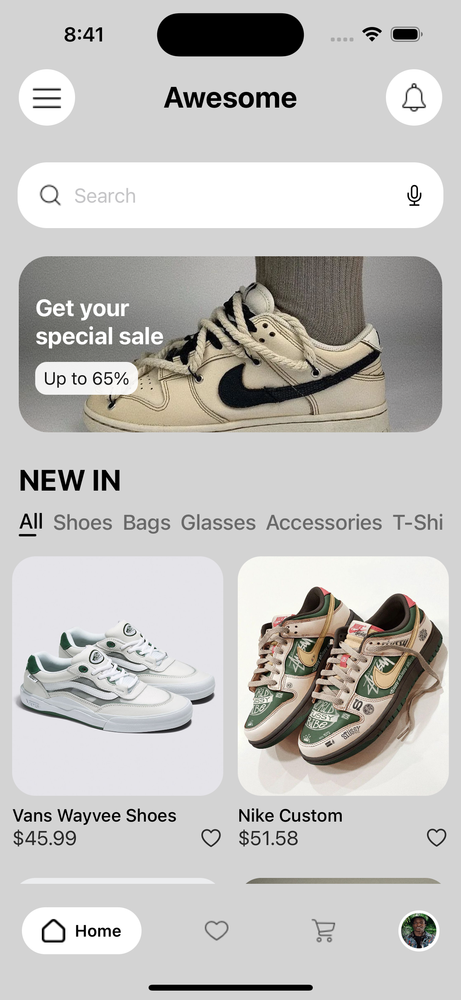
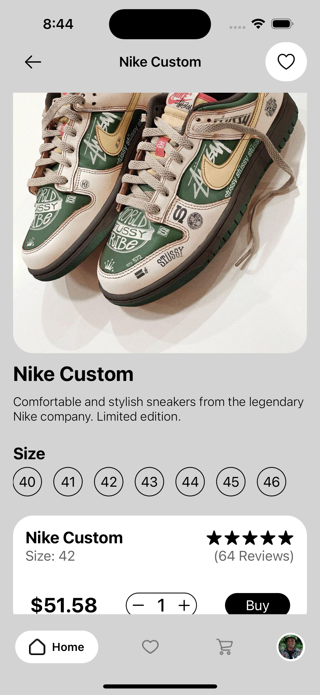
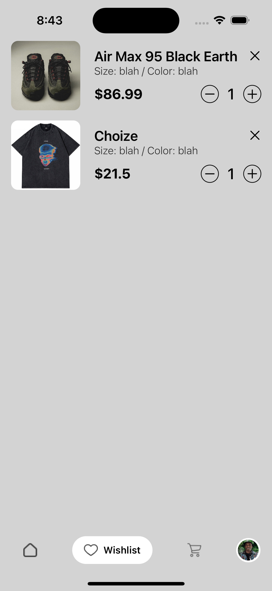
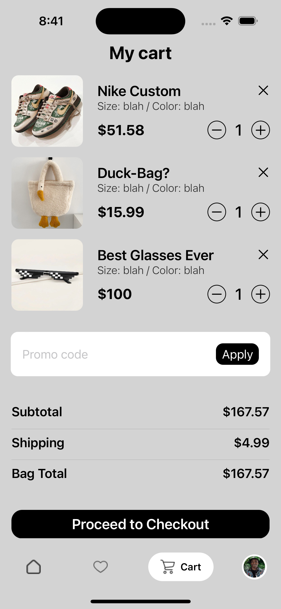
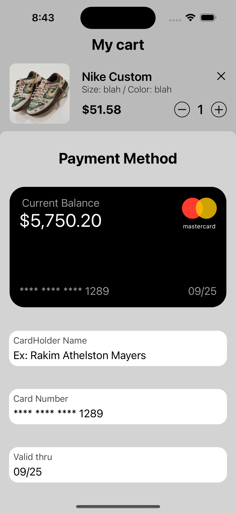
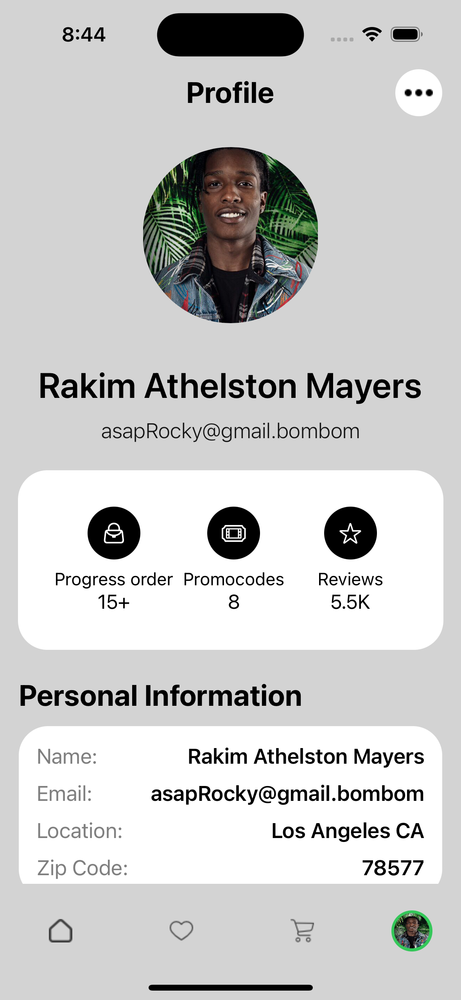

# StoreApp - SwiftUI / MVVM / UserDefaults / BottomSheet

An example of a clothing store with multiple screens. Built on the MVVM architecture using UserDefaults for storing goods. Multiple functions to add and remove to the cart or wishlist. Custom TabBar for navigation.

## Home Screen

## Detail Screen

## WishList Screen

## Cart Screen 

## Payment Sheet

## Profile Screen

